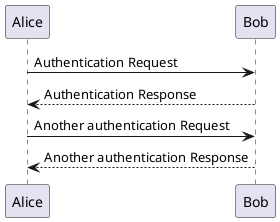
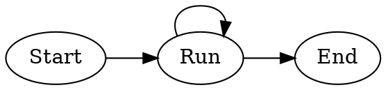
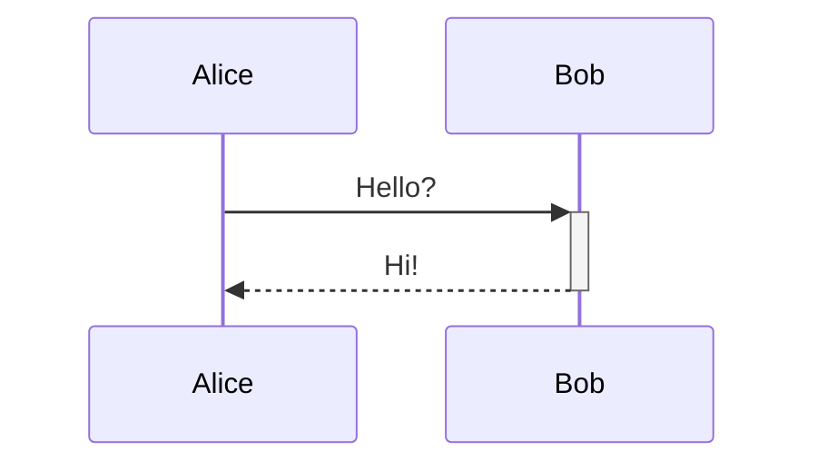

# Kroki Diagram Test

Kroki 공개 서비스(<https://kroki.io>)를 통해 렌더링되는 다이어그램입니다.

## PlantUML



## D2

```d2
direction: right

users -> api: Request
api -> database: Query
database -> api: Result
api -> users: Response
```

## Graphviz (dot)



## Pikchr

```pikchr
arrow right 200% "Markdown" "Source"
box rad 10px "Process"
arrow right "HTML" "Output"
```

## Svgbob (ASCII)

```svgbob
   .---.
  / .-. \
 |  |X|  |
  \ '-' /
   '---'
```

## Nomnoml

```nomnoml
[Pirate|eyeCount: Int|raid();pillage()|
  [beard]--[parrot]
  [beard]-:>[foul mouth]
]
```

## WaveDrom

```wavedrom
{ signal: [
  { name: "clk", wave: "p....." },
  { name: "data", wave: "x.345x", data: ["head", "body", "tail"] }
]}
```

## Vega-Lite

```vegalite
{
  "$schema": "https://vega.github.io/schema/vega-lite/v5.json",
  "data": {"values": [
    {"a": "A", "b": 28}, {"a": "B", "b": 55}, {"a": "C", "b": 43}
  ]},
  "mark": "bar",
  "encoding": {
    "x": {"field": "a", "type": "nominal"},
    "y": {"field": "b", "type": "quantitative"}
  }
}
```

## 비교: Mermaid (Kroki 안 거치고 클라이언트 렌더링)



## 비교: Bash 코드 (highlight.js 동작 확인)

```bash
echo "Kroki 안 거침"
ls -la
```

---

## 참고: 알려진 Kroki 공개 서비스 이슈

다음 형식은 <https://kroki.io> 공개 인스턴스에서 응답이 비어있는 경우가 있어 샘플에서 제외했습니다. **자체 호스트한 Kroki 인스턴스에서는 정상 동작**합니다:

- `blockdiag`, `seqdiag`, `actdiag`, `nwdiag`, `rackdiag`, `packetdiag`
- `bpmn` (완전한 BPMN process XML 필요)

자체 호스트는 `markdown-x.krokiServerUrl` 설정에 자체 URL 지정.
